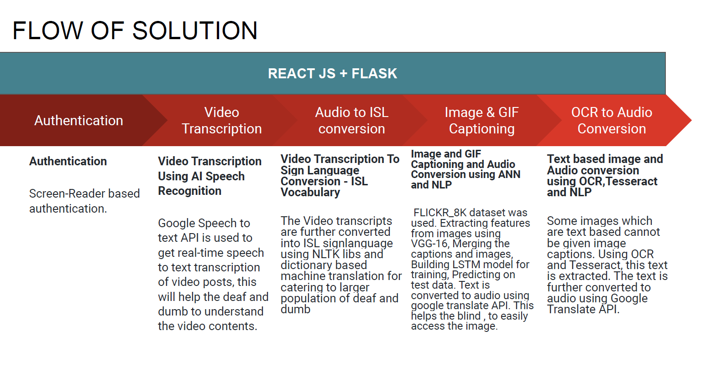
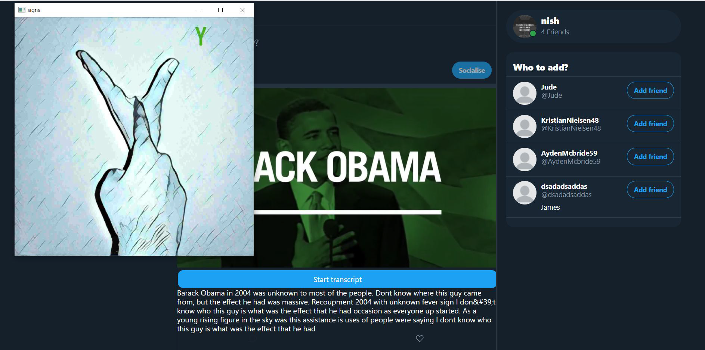

# Socialise | Social Network App for physically challenged

Every person has an equal right to information and impairments shouldn’t restrict people from gaining this information. So, the main motive here is to make social media application, which is a source of information, more accessible to the blind,deaf and dumb. Provisions have to me made keeping in mind their difficulties and interests.

## Project Screenshot
  

  
  

## Project Features:
- Nice design as Twitter design.
- Fully responsive design (100%).
- ISL language Video transcription for Deaf and Dumb 
- Image Captioning 
- GIF Captioning
- OCR for text extraction from POSTs
- Dark/Light theme.
- English/German languages.
- Notifications in app.

## Technologies used in the project:
### 1- Backend:
    - Tensorflow
    - OpenCV
    - Tessaract OCR
    - Google Text-to-Speech API
    - using 'Firebase cloud function' + 'Express.js' to build an API, to handle all operations with database.
    - using 'Firebase Triggers' to execute some events in app like (fire notification, listen to user avatar changes, etc..).
    - using 'Firebase Authentication' to handel login/signup users.
    - using 'Firebase Firestore&Storage' to store data of the app (NoSQL database).

### 2- Frontend:
    - using 'React.js' to build the frontend of Twirrer.
    - using 'React Hooks' to handle local state & 'React Context api' to handle global state in the app.
    - using 'Axios' to execute all RestFull api requests in the app.
    - implement infinite scroll (pure js) to posts in home page
    - using 'SCSS, CSS Normalize & Css Resets'.
    - using 'BEM' methodology to naming the items in HTML.
